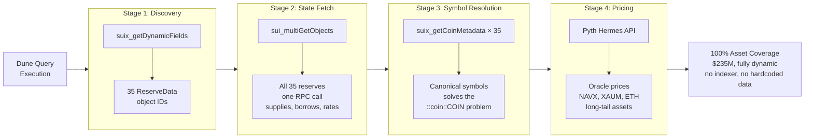
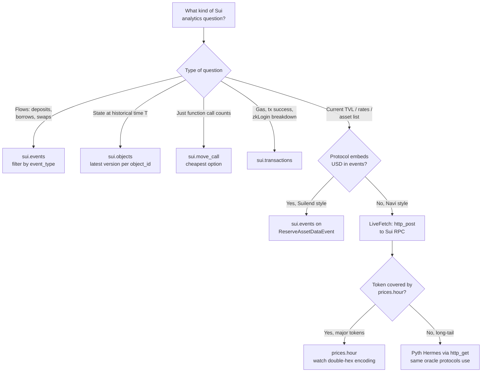

# Dune Sui Query Builder

An [agent skill](https://agentskills.io/) for building, debugging, and optimizing **DuneSQL** queries against **Sui** blockchain data — chained Sui RPC and Pyth Hermes patterns that go beyond what indexed tables alone can deliver. Works with Claude, Cursor, OpenCode, Codex, Gemini CLI, and any agent-skill-compatible tool.

   

---

## The hook

Sui's lending and most DeFi protocols don't have decoded curated tables on Dune. The official `lending.*` tables [cover 15 EVM chains](https://docs.dune.com/data-catalog/curated/lending/overview); `dex.trades` [covers EVM + Solana](https://docs.dune.com/data-catalog/curated/dex-trades/overview). A few narrow Sui-specific curated tables exist (`sui_walrus.*`, `sui_daily.*`, `sui_tvl.*`), and a `dex_sui.trades` table is observable in the data explorer but isn't documented in the official catalog as of May 2026. For Sui lending specifically — which is what this skill is built for — you query `sui.events` directly and filter by `event_type` string.

That makes **package-identity verification a critical skill**. Without it, a single hex mismatch can sit unchallenged in widely-cited dashboards. Concrete example: the most-cited "Navi Protocol" reference on Dune ([Prudentia Labs' dashboard](https://dune.com/mementomori7777/navi-protocol-full-dashboard), 19 charts) queries `0xf95b06141...::reserve::ReserveAssetDataEvent` — which is **Suilend's** package, not Navi's. Triple-confirmed against Suilend's [SDK](https://docs.suilend.fi/), [GitHub](https://github.com/suilend/suilend), and DefiLlama. Not a criticism of the team — a reminder that on Sui, you have to verify the bytes.

This skill packages the methodology.

## Proof of value

Built using this skill in a single weekend:

**[Sui Lending: Navi vs Suilend — Two Paths to ~$150M TVL](https://dune.com/0x_vcharles/sui-lending-navi-vs-suilend)**

- 15 visualizations, both protocols, fully on-chain
- 100% asset coverage on Navi's $235M — no third-party indexer
- The 4-stage on-chain pricing pipeline below — pure SQL + Sui RPC + Pyth, refreshes every execution

## Architecture: the 4-stage on-chain pipeline

When a protocol's events don't embed USD values (Navi-style — most pre-2026 Sui lending), historical replay is hard. This pipeline solves *current* state from on-chain primitives alone:



Runs entirely from Dune SQL + Sui RPC via `http_post` LiveFetch + Pyth Hermes. No separate indexer, no hardcoded asset list, no hardcoded prices. Refreshes on every query execution.

Full annotated SQL: [`examples/navi-v8-pipeline.sql`](./examples/navi-v8-pipeline.sql) · Reference doc: [`references/protocol-patterns.md`](./references/protocol-patterns.md)

## Which Dune source for what?

Sui's data model is fundamentally different from EVM (curated tables for most DeFi) and Solana (object-centric state). For Sui lending and most protocol-specific work, tool selection is non-obvious:



This decision tree, the schema breakdowns, and the anti-patterns are all encoded in [`references/sui-data-model.md`](./references/sui-data-model.md).

## What's in the box

```
dune-sui-query-builder/
├── SKILL.md                       Task router: Build / Debug / Optimize / Investigate
├── references/
│   ├── sui-data-model.md          Dune Sui table catalog · 8 edge cases ·
│   │                              LiveFetch · Pyth Hermes · anti-patterns
│   └── protocol-patterns.md       Navi 3-package archaeology · Suilend schemas ·
│                                  the V8 4-stage pipeline · comparative analysis
└── examples/
    └── navi-v8-pipeline.sql       Standalone production SQL — copy-paste-ready
```

The two `references/` files are written to **stand alone as documentation** — you don't need to be a Claude user to get value from them. Read them like a technical handbook for analysts working on Sui.

## How this fits with Dune's tooling

Dune ships its own [agent skill](https://github.com/duneanalytics/skills), [MCP server](https://docs.dune.com/api-reference/agents/mcp), and [CLI](https://docs.dune.com/api-reference/agents/cli-and-skills) — they teach agents how to discover datasets, write DuneSQL, execute queries, and manage costs. That's the *execution layer*. This is a *Sui domain layer* on top, focused on use cases where Dune's curated tables don't yet reach:

| Domain | Dune curated coverage (May 2026) | What this skill adds |
|---|---|---|
| Sui lending (Navi, Suilend, Scallop) | None — `lending.*` is 15 EVM chains | Package archaeology, event schemas, the V8 LiveFetch pipeline |
| Sui DEX (Cetus, Bluefin, DeepBook) | `dex_sui.trades` appears in the data explorer but undocumented in the official catalog — verify before relying | Raw `sui.events` patterns; V0.2 will audit `dex_sui.trades` properly |
| Sui base data | 8 chain tables, [well-documented](https://docs.dune.com/data-catalog/sui/overview) | Sui edge cases: binary types, JSON parsing, double-hex `prices.hour`, the `::coin::COIN` problem |
| General DuneSQL | All Dune docs | Use Dune's official skill |

Recommended stack: **Dune MCP/Skill/CLI for execution + this skill for Sui domain knowledge + your agent of choice** (Claude, Cursor, Codex, Gemini CLI — anything agent-skill-compatible).

The `references/` markdown files are also usable as plain documentation by humans — no agent required.

## Installation

### As an agent skill

Agent skills are an [open standard](https://agentskills.io/) supported by Claude (Code, Desktop, .ai), Cursor, OpenCode, Codex, Gemini CLI, Goose, and more.

**Claude.ai (web/desktop):**
1. Clone or download this repo
2. ZIP the folder: `zip -r dune-sui-query-builder.zip dune-sui-query-builder/`
3. Upload via Claude → Settings → Capabilities → Skills

**Claude Code, Cursor, and most other agents** (skill auto-loaded from `~/.claude/skills/` or equivalent):
```bash
git clone https://github.com/vchrl/dune-sui-query-builder.git \
  ~/.claude/skills/dune-sui-query-builder
```

Adjust the destination path per your agent's skill directory convention. The skill auto-triggers on prompts mentioning Dune, DuneSQL, Sui queries, Move events, LiveFetch, Navi, Suilend, Pyth, etc. See the full trigger list in [`SKILL.md`](./SKILL.md).

### As reference documentation (no agent needed)

Just read `references/sui-data-model.md` and `references/protocol-patterns.md` directly. They were written to be skimmable for someone debugging at 2am — schema breakdowns, full SQL examples, anti-patterns observed in real production dashboards.

## Quick start

Three prompts that demonstrate what the skill enables:

> *"Build me a Dune query for Suilend's 90-day daily TVL by tier."*
> → Returns a partition-pruned query against `ReserveAssetDataEvent`, with the `1e18` decimal scaling and the FUD-token filter pre-applied.

> *"Here's a Dune query [link]. Debug it — the TVL chart cuts off at Feb 2026."*
> → Identifies missing package coverage, suggests the multi-package UNION ALL pattern with per-branch date filters.

> *"The mementomori 'Navi Protocol' dashboard — is it accurate?"*
> → Pulls the SQL, decodes the package hexes, confirms it's actually Suilend, outputs an audit.

## What's solid in V0.1

- Dune Sui table catalog: `sui.events`, `sui.objects`, `sui.move_call`, `sui.transactions`, `sui.move_package`
- Binary type decoding, JSON-string parsing, partition pruning patterns
- LiveFetch patterns: single-call, multi-stage CTE chains, parallel per-row
- Pyth Hermes integration with verified feed IDs (April 2026)
- Navi 3-package archaeology + complete event_type strings
- Suilend `ReserveAssetDataEvent` schema (the USD-in-events trick)
- The V8 4-stage pipeline (validated, 100% coverage on $235M)
- 8 anti-patterns from real production dashboards, with corrections

## V0.1 limitations — read before relying

This is a V0.1 release. Be aware of:

- **Pyth feed IDs are point-in-time** (verified April 2026). Feed IDs are usually stable but verify before production use.
- **Curated Dune tables for Sui are evolving.** As of May 2026, Dune's `lending.*` and `dex.trades` curated tables don't include Sui. A `dex_sui.trades` table appears in the data explorer but isn't documented in the official catalog — verify schema and coverage if you plan to use it. V0.2 will audit these properly.
- **Only Navi and Suilend deeply mapped.** Cetus, Bluefin, Scallop, Aftermath, DeepBook, Volo, Haedal are mentioned in the trigger description but not yet documented with schemas and patterns. Contributions very welcome.
- **Liquidation event paths for Navi** flagged in the skill but not yet sampled — you'll need to discover them via the included discovery query before relying.
- **Some `event_json` field paths are best-guesses** from SDK code and explicitly flagged with uncertainty disclaimers. The skill instructs Claude to verify by sampling before using.
- **Historical Navi TVL not yet built.** The path via `sui_tryGetPastObject` is documented but not implemented — see roadmap.
- **LiveFetch caveats apply:** 5s timeout per call, ~80 req/s rate limit, no caching across executions. Queries with hundreds of parallel RPC calls may hit limits.
- **No automated eval suite yet.** Skill quality is validated by the production dashboard it shipped — but there's no automated regression test corpus. V0.2 target.

## Roadmap

### V0.2
- **Audit emerging Sui curated tables** — `dex_sui.trades`, `sui_walrus.*`, `sui_daily.*`, `sui_tvl.*`. Document schemas, coverage windows, freshness, and integration patterns with the raw `sui.events` approach.
- **Pure-Pyth pricing** — discover all 35 Navi asset Pyth feed IDs from Navi's on-chain oracle registry; batch them in one Hermes call. Adds confidence intervals + EMA prices.
- **Historical Navi TVL** via `sui_tryGetPastObject` snapshots. Date → checkpoint → object version mapping, replayable from any starting point.
- **Cetus and Bluefin** protocol patterns (DEX/perps).
- **Eval suite:** corpus of prompts + expected behaviors, run on every skill update.

### Future
- Scallop, DeepBook, Aftermath, Volo, Haedal protocol patterns
- Walrus / Seal references if Mysten ecosystem analytics use cases emerge
- Generalized "discover all events emitted by a package" workflow

## Why this exists

Sui lending has no decoded protocol tables on Dune, so every analyst rediscovers the same edge cases — binary type handling, the `::coin::COIN` problem, package upgrades that silently truncate history, the double-hex encoding in `prices.hour`. This skill packages a weekend's worth of comparative-lending-protocol work into something portable.

Public because the methodology is useful for anyone analyzing Sui on Dune, and the work belongs somewhere the next person can find it.

Built by [Vincent Charles](https://github.com/vchrl) — independent blockchain data analyst (Unchain Data; previously: Binance, Morpho Labs, Orca). Built with [Claude](https://www.anthropic.com/claude) + [Dune MCP](https://docs.dune.com/api-reference/agents/mcp).

## Contributing

PRs welcome, especially:
- **New protocol patterns** in `references/protocol-patterns.md`
- **Newly-verified Pyth feed IDs** (with timestamp of verification)
- **New anti-patterns** observed in production
- **Eval prompts** — prompts + expected behaviors for skill quality regression

Please match the existing markdown style: code blocks with full SQL, explicit uncertainty disclaimers, anti-patterns labeled as such.

## Credits & references

- [Dune Analytics](https://dune.com) — query engine, LiveFetch (`http_post` / `http_get`), the [MCP server](https://docs.dune.com/api-reference/agents/mcp) that made the workflow possible
- [Pyth Network](https://pyth.network) — on-chain oracle, [Hermes API](https://hermes.pyth.network/docs)
- [Mysten Labs](https://mystenlabs.com) and the [Sui Foundation](https://sui.io) — Sui blockchain and developer docs
- [Anthropic](https://anthropic.com) — Claude and the [skills framework](https://www.anthropic.com/news/skills)
- **Suilend team** (formerly Solend) — `ReserveAssetDataEvent` schema reverse-engineered from their [open-source Move code](https://github.com/suilend/suilend)
- **Navi team** — SDK code referenced for `event_json` field path inference
- **Prudentia Labs** — operates the most-cited Sui lending dashboard; the mislabel investigation is not a criticism of them, but a reminder of how easily one package hex can propagate as canonical truth

## License

MIT — see [LICENSE](./LICENSE)

---

*Found a bug? Open an issue. Built something with it? Tag [@0x_vcharles](https://x.com/0x_vcharles) — would love to see.*
