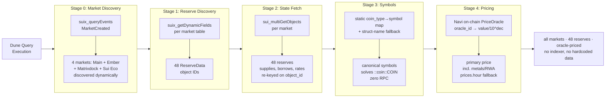
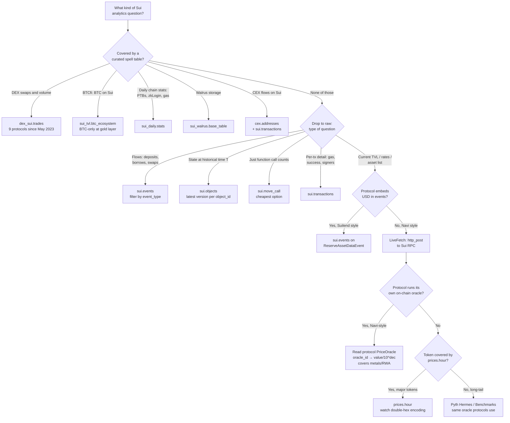

# Dune Sui Query Builder

An [agent skill](https://agentskills.io/) for building, debugging, and optimizing **DuneSQL** queries against **Sui** blockchain data, including chained Sui RPC and Pyth Hermes patterns that go beyond what indexed tables alone deliver. Works with Claude, Cursor, OpenCode, Codex, Gemini CLI, and any agent-skill-compatible tool.

   

---

## The hook

Sui's lending and most protocol-specific DeFi don't have decoded curated tables on Dune. The official `lending.*` tables [cover 15 EVM chains](https://docs.dune.com/data-catalog/curated/lending/overview); `dex.trades` [covers EVM + Solana](https://docs.dune.com/data-catalog/curated/dex-trades/overview), not Sui directly. **What does exist for Sui** (verified May 2026): 5 curated spell tables, `dex_sui.trades` (DEX swaps across 9 protocols, full multi-asset), `sui_tvl.btc_ecosystem` (BTCfi-only, BTC TVL across 5 lending protocols and DEX pools), `sui_daily.stats` (chain activity), `sui_walrus.base_table` (Walrus storage), `cex.addresses` (cross-chain, includes Sui). For multi-asset Sui lending (Navi, Suilend, Scallop, Bucket, AlphaLend at the full-portfolio level, not just BTC), LP positions, protocol internals, and most other granular work, you still query `sui.events` directly.

That makes **package-identity verification a critical skill**. Without it, a single hex mismatch can sit unchallenged in widely-cited dashboards. Concrete example: the most-cited "Navi Protocol" reference on Dune ([Prudentia Labs' dashboard](https://dune.com/mementomori7777/navi-protocol-full-dashboard), 19 charts) queries `0xf95b06141...::reserve::ReserveAssetDataEvent`, which is **Suilend's** package, not Navi's. Triple-confirmed against Suilend's [SDK](https://docs.suilend.fi/), [GitHub](https://github.com/suilend/suilend), and DefiLlama. Not a criticism of the team, a reminder that on Sui you have to verify the bytes.

This skill packages the methodology: when to use curated tables, when to drop down to raw events.

## Proof of value

Everything below was built with this skill, fully on-chain, no third-party indexer, each figure priced from the protocol's own on-chain state and reconciled against an independent recount.

**[Sui Lending: Navi vs Suilend, Two Paths to ~$150M TVL](https://dune.com/0x_vcharles/sui-lending-navi-vs-suilend)** — 15 visualizations across both protocols, the fullest side-by-side of the two on Dune.

**[Navi Protocol: A verified approach](https://dune.com/0x_vcharles/navi-protocol-a-verified-approach)** — all four isolated Navi markets and every reserve, priced on Navi's own on-chain oracle, tracking the migration from the old shared pool into the isolated markets day by day. Pure SQL plus Sui RPC, refreshes on every execution.

**[Suilend Liquidations and Bad Debt: the historical record](https://dune.com/0x_vcharles/suilend-liquidations-and-bad-debt-the-historical-record)** — every Suilend liquidation since launch (98,407), each priced at the reserve mark inside its own transaction, the exact mark the engine used, not the day's close. The one bad-debt episode in the protocol's history (IKA, September 2025) is reconstructed on-chain from `ForgiveEvent` and DEX prices, showing the oracle marking IKA near six times its traded price during the cascade. Reads from a materialized view, with the methodology and a verification record on the dashboard itself.

## Architecture: the Navi live-state pipeline

When a protocol's events don't embed USD values (Navi-style, most pre-2026 Sui lending), historical replay is hard. This pipeline solves *current* state from on-chain primitives alone, across all of Navi's markets (Main plus 3 isolated):



Runs entirely from Dune SQL + Sui RPC via `http_post` LiveFetch, priced from **Navi's own on-chain oracle** (the exact source the protocol uses for liquidations; `prices.hour` as a free fallback). No separate indexer, no hardcoded asset list, no hardcoded prices. Refreshes on every query execution. An earlier Pyth-Hermes-priced, Main-market-only version is preserved in `examples/legacy/`.

Full annotated SQL: [`examples/navi-v9-multimarket.sql`](./examples/navi-v9-multimarket.sql) (live) · [`examples/navi-v9-multimarket-historical.sql`](./examples/navi-v9-multimarket-historical.sql) (90-day historical) · Reference doc: [`references/protocol-patterns.md`](./references/protocol-patterns.md)

## Which Dune source for what?

Sui's data model is fundamentally different from EVM (curated tables for most DeFi) and Solana (object-centric state). Sui has 5 curated spell tables for specific domains; everything else drops to raw event/object archaeology:



For a thin token with no oracle feed, a `dex_sui.trades` daily VWAP sits between protocol-emitted USD and Pyth as the long-tail price source (the Suilend IKA reconstruction uses exactly this).

This decision tree, the schema breakdowns, and the anti-patterns are encoded in [`references/sui-data-model.md`](./references/sui-data-model.md); the curated-table branch is fully documented in [`references/sui-curated-tables.md`](./references/sui-curated-tables.md).

## What's in the box
dune-sui-query-builder/
├── SKILL.md                       Task router: Build / Debug / Optimize / Investigate
├── references/
│   ├── sui-data-model.md          Dune Sui table catalog · 14 edge cases / anti-patterns ·
│   │                              LiveFetch · pricing decision tree · matview serving layer
│   ├── sui-curated-tables.md      Curated Sui spell tables · dex_sui.trades schema + VWAP ·
│   │                              BTCfi, daily stats, Walrus · when to use curated vs raw
│   ├── protocol-patterns.md       Navi 3-package archaeology · isolated markets · live-state
│   │                              pipeline · Suilend pack: liquidations, same-tx cToken pricing, IKA
│   └── verification-toolkit.md    Raw-events recount · stablecoin cross-check · cToken penalty
└── examples/
├── navi-v9-multimarket.sql            Live multi-market TVL (4 markets, 48 reserves) — primary
├── navi-v9-multimarket-historical.sql 90-day historical replay (scoped on-chain oracle)
├── suilend-liquidations-priced.sql    Suilend liquidations priced per event, same-tx (matview source, q7756564)
├── suilend-ika-bad-debt.sql           IKA bad debt: dex_sui.trades VWAP vs liquidations (q7757951)
└── legacy/
└── navi-v8-pipeline.sql           V8.1 Main-only, Pyth-priced — superseded

The four `references/` files are written to **stand alone as documentation**. You don't need to be a Claude user to get value from them; read them like a technical handbook for analysts working on Sui.

## How this fits with Dune's tooling

Dune ships its own [agent skill](https://github.com/duneanalytics/skills), [MCP server](https://docs.dune.com/api-reference/agents/mcp), and [CLI](https://docs.dune.com/api-reference/agents/cli-and-skills); they teach agents how to discover datasets, write DuneSQL, execute queries, and manage costs. That's the *execution layer*. This is a *Sui domain layer* on top: when to reach for which Sui table, what's curated versus what needs raw event work.

| Domain | Dune coverage (verified May 2026) | What this skill adds |
|---|---|---|
| Sui DEX swaps (Cetus, Bluefin, DeepBook, Aftermath, Kriya, FlowX, Momentum, BlueMove, Obric) | ✅ `dex_sui.trades`, 9 projects, since May 2023 | Schema reference, partition pruning, worked examples, when to drop to raw events |
| Sui BTCfi (BTC on Sui across DEX + lending) | ✅ `sui_tvl.btc_ecosystem` + `_gold` intermediates | Schema documentation (intermediates aren't in Dune's data hub search) |
| Sui chain stats (PTBs, zkLogin, gas, success rate) | ✅ `sui_daily.stats` | Pointer + worked example |
| Walrus storage | ✅ `sui_walrus.base_table` | Pointer |
| Sui CEX flows | ⚠️ Partial, `cex.addresses` includes Sui labels but no `cex_flows_sui.*` table, join with `sui.transactions` yourself | DIY pattern |
| Sui lending (Navi, Suilend, Scallop, Bucket, AlphaLend) | ⚠️ Partial, `sui_tvl.lending_pools_gold` publishes BTC-only TVL across these 5 protocols; spellbook source has bronze models for full multi-asset data but isn't published as a gold table | Package archaeology, event schemas, the live-state LiveFetch pipeline (the practical path for multi-asset, granular, real-time lending data) |
| Sui DEX *internals* (LP positions, fee tiers, pool depth) | ❌ Only swap-level via `dex_sui.trades` | Raw `sui.events` / `sui.objects` patterns |
| Sui base chain data | ✅ 8 chain tables, [well-documented](https://docs.dune.com/data-catalog/sui/overview) | Sui edge cases: binary types, JSON parsing, double-hex `prices.hour`, the `::coin::COIN` problem |

Recommended stack: **Dune MCP/Skill/CLI for execution + this skill for Sui domain knowledge + your agent of choice** (Claude, Cursor, Codex, Gemini CLI, anything agent-skill-compatible).

## Companion: building the dashboard

Putting these queries on a public Dune dashboard is mostly not Sui-specific, so the skill body stays SQL-focused and the generic mechanics route to [Dune's official skill](https://github.com/duneanalytics/skills). Notes worth carrying:

- Mermaid does render inside Dune text widgets.
- `updateDashboard` is all-or-nothing, so always `getDashboard` first and send the full state back.
- The layout grid is 6 columns. An Ilemi-style left explainer beside each chart, with numbered full-width section separators, reads well.
- Only promoted (non-temp) queries render on a public dashboard.
- Duplicate-x aggregation (Sum vs Pick first) is not settable via the API and has caused a TVL undercount; set it in the Dune UI.

The one presentation detail that is Sui-specific lives in the skill, not here: clickable account cells via `get_href('https://suiscan.xyz/mainnet/account/' || addr || '/portfolio', addr)` (see `references/protocol-patterns.md`).

## Installation

### As an agent skill

Agent skills are an [open standard](https://agentskills.io/) supported by Claude (Code, Desktop, .ai), Cursor, OpenCode, Codex, Gemini CLI, Goose, and more.

**Claude.ai (web/desktop):**
1. Clone or download this repo
2. ZIP the folder: `zip -r dune-sui-query-builder.zip dune-sui-query-builder/`
3. Upload via Claude → Settings → Capabilities → Skills

**Claude Code, Cursor, and most other agents** (skill auto-loaded from `~/.claude/skills/` or equivalent):
```bash
git clone https://github.com/vchrl/dune-sui-query-builder.git \
  ~/.claude/skills/dune-sui-query-builder
```

Adjust the destination path per your agent's skill directory convention. The skill auto-triggers on prompts mentioning Dune, DuneSQL, Sui queries, Move events, LiveFetch, Navi, Suilend, Pyth, and more. See the full trigger list in [`SKILL.md`](./SKILL.md).

### As reference documentation (no agent needed)

Read `references/sui-data-model.md`, `references/sui-curated-tables.md`, `references/protocol-patterns.md`, and `references/verification-toolkit.md` directly. They were written to be skimmable for someone debugging at 2am: schema breakdowns, full SQL examples, anti-patterns observed in real production dashboards.

## Quick start

Three prompts that demonstrate what the skill enables:

> *"Build me a Dune query for Suilend's 90-day daily TVL by tier."*
> → Returns a partition-pruned query against `ReserveAssetDataEvent`, with the `1e18` decimal scaling and the FUD-token filter pre-applied.

> *"Here's a Dune query [link]. Debug it, the TVL chart cuts off at Feb 2026."*
> → Identifies missing package coverage, suggests the multi-package UNION ALL pattern with per-branch date filters.

> *"The mementomori 'Navi Protocol' dashboard, is it accurate?"*
> → Pulls the SQL, decodes the package hexes, confirms it's actually Suilend, outputs an audit.

## Known limits

- **Pyth feed IDs are point-in-time** (verified April 2026). Usually stable, but verify before production use.
- **`sui_tvl.*_gold` intermediates** aren't in Dune's data hub search and publish a BTC-only slice; sample before relying, and note that full multi-asset Sui lending still needs the raw-events path.
- **LiveFetch caveats:** 5s timeout per call, ~80 req/s rate limit, no caching across executions. Queries with hundreds of parallel RPC calls may hit limits.
- **Some `event_json` field paths are inferred** from SDK code and flagged with uncertainty; the skill verifies by sampling before use.
- **No automated eval suite yet.** Skill quality is validated by the production dashboards it shipped.

## Roadmap

- **Per-DEX internals:** Cetus concentrated liquidity, DeepBook orderbook state, Bluefin perps. Hybrid: `dex_sui.trades` for volume plus raw `sui.events` / `sui.objects` for internals.
- **Multi-asset Sui lending TVL** beyond BTCfi, using a hybrid of `sui_tvl.lending_pools_gold` plus raw events.
- **Eval suite:** a corpus of prompts plus expected behaviors, run on every skill update.
- **Further protocol packs:** Scallop, Aftermath, Volo, Haedal. A generalized "discover all events emitted by a package" workflow. Walrus / Seal references if Mysten ecosystem use cases emerge.

Version history is in [CHANGELOG.md](./CHANGELOG.md).

## Why this exists

Sui's DeFi data on Dune is uneven: strong curated coverage for DEX swaps, BTCfi, and chain stats, but lending and most protocol internals still require raw `sui.events` archaeology. Every analyst rediscovers the same edge cases: binary type handling, the `::coin::COIN` problem, package upgrades that silently truncate history, the double-hex encoding in `prices.hour`. This skill packages that work into something portable.

Public because the methodology is useful for anyone analyzing Sui on Dune, and the work belongs somewhere the next person can find it.

Built by [Vincent Charles](https://github.com/vchrl), independent blockchain data analyst ([Unchain Data](https://unchaindata.xyz/dune-dashboards); previously Binance, Morpho Labs, Orca). Built with [Claude](https://www.anthropic.com/claude) + [Dune MCP](https://docs.dune.com/api-reference/agents/mcp).

## Contributing

PRs welcome, especially:
- **New protocol patterns** in `references/protocol-patterns.md`
- **Newly-verified Pyth feed IDs** (with timestamp of verification)
- **New anti-patterns** observed in production
- **Eval prompts**, prompts plus expected behaviors for skill quality regression

Please match the existing markdown style: code blocks with full SQL, explicit uncertainty disclaimers, anti-patterns labeled as such.

## Credits & references

- [Dune Analytics](https://dune.com), query engine, LiveFetch (`http_post` / `http_get`), the [MCP server](https://docs.dune.com/api-reference/agents/mcp) that made the workflow possible
- [Pyth Network](https://pyth.network), on-chain oracle, [Hermes API](https://hermes.pyth.network/docs)
- [Mysten Labs](https://mystenlabs.com) and the [Sui Foundation](https://sui.io), Sui blockchain and developer docs
- [Anthropic](https://anthropic.com), Claude and the [skills framework](https://www.anthropic.com/news/skills)
- **Suilend team** (formerly Solend), `ReserveAssetDataEvent` schema reverse-engineered from their [open-source Move code](https://github.com/suilend/suilend)
- **Navi team**, SDK code referenced for `event_json` field path inference
- **Prudentia Labs**, operates the most-cited Sui lending dashboard; the mislabel investigation is not a criticism of them, but a reminder of how easily one package hex can propagate as canonical truth

## License

MIT, see [LICENSE](./LICENSE)

---

*Found a bug? Open an issue. Built something with it? Tag [@0x_vcharles](https://x.com/0x_vcharles), would love to see.*

---

Built by Vincent Charles, Unchain Data. I build reconciled, defensible on-chain dashboards for Sui and EVM protocols, the kind this skill is designed to produce. Need one for your protocol? [unchaindata.xyz/dune-dashboards](https://unchaindata.xyz/dune-dashboards)
