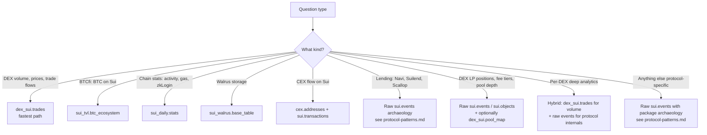

# Sui Curated Spell Tables on Dune

Reference for Sui-specific **curated spell tables** maintained by Dune. These are the entry points to use *before* falling back to raw `sui.events` archaeology — when a curated table covers your need, it's dramatically simpler and cheaper.

This is **complementary** to `sui-data-model.md` (which covers raw chain tables) and `protocol-patterns.md` (which covers package-level lending work).

## Table of Contents

1. [The 5 curated Sui spell tables](#the-5-curated-sui-spell-tables)
2. [`dex_sui.trades` — the DEX workhorse](#dex_suitrades--the-dex-workhorse)
3. [`sui_tvl.btc_ecosystem` and the `_gold` intermediates](#sui_tvlbtc_ecosystem-and-the-_gold-intermediates)
4. [`sui_daily.stats` — chain-level aggregates](#sui_dailystats--chain-level-aggregates)
5. [`sui_walrus.base_table` — Walrus storage](#sui_walrusbase_table--walrus-storage)
6. [`cex.addresses` — CEX wallet labels (cross-chain, includes Sui)](#cexaddresses--cex-wallet-labels)
7. [When to use curated vs. raw `sui.events`](#when-to-use-curated-vs-raw-suievents)
8. [Worked examples](#worked-examples)
9. [V0.1 caveats](#v01-caveats)

## The 5 curated Sui spell tables

Verified via Dune MCP `searchTables` (May 2026):

| Table | Domain | Partition | Notes |
|---|---|---|---|
| `dex_sui.trades` | DEX swaps across 9 protocols | `block_month` | Standard Dune DEX schema, same as `dex.trades` / `dex_solana.trades` |
| `sui_tvl.btc_ecosystem` | BTCfi adoption on Sui (DEX + lending + supply) | `block_date` | Composite: rolls up the 3 `_gold` intermediates below |
| `sui_daily.stats` | Daily chain stats (PTBs, zkLogin, sponsored tx, gas, success rate) | `block_month` | Built from `sui.transactions` |
| `sui_walrus.base_table` | Walrus blob registrations and certifications | `block_month` | Built from `sui.events` |
| `cex.addresses` | CEX wallet addresses (cross-chain, includes Sui) | — | Pair with `sui.transactions` for CEX flow analysis on Sui |

Three additional intermediate tables exist as spellbook dbt models but aren't surfaced in Dune's data hub search — they're directly queryable:
- `sui_tvl.dex_pools_gold` — daily DEX pool TVL
- `sui_tvl.lending_pools_gold` — daily lending TVL across 5 protocols (navi, suilend, scallop, bucket, alphalend). **BTC-only at the public gold layer** — verified schema is 10 columns, all BTC-denominated. Multi-asset lending data exists in the underlying bronze tables but isn't published.
- `sui_tvl.supply_gold` — supply/balance registries

These three are the *gold* aggregations consumed by `sui_tvl.btc_ecosystem`. Treat them as supported (production queries depend on them) but undocumented in Dune's data hub. The spellbook source for these models lives at [duneanalytics/spellbook/dbt_subprojects/daily_spellbook/models/sui/tvl/](https://github.com/duneanalytics/spellbook/tree/main/dbt_subprojects/daily_spellbook/models/sui/tvl) — inspect there to understand bronze → silver → gold transformations.

## `dex_sui.trades` — the DEX workhorse

The Sui equivalent of `dex.trades` (EVM) and `dex_solana.trades` (Solana). Identical schema convention, so EVM/Solana experience carries over directly.

### Schema (28 columns)

| Column | Type | Notes |
|---|---|---|
| `blockchain` | varchar | Always `'sui'` |
| `project` | varchar | DEX name — see project list below |
| `block_month` | timestamp | **Partition key — always filter** |
| `block_date` | date | For daily aggregations |
| `block_time` | timestamp | Sub-daily resolution |
| `epoch`, `checkpoint` | decimal | Sui-specific blockchain markers |
| `pool_id` | varchar | Sui object ID of the pool |
| `sender` | varbinary | Trader address (binary — decode with `concat('0x', lower(to_hex(sender)))`) |
| `transaction_digest` | varchar | Sui tx hash |
| `event_index` | decimal | Event sequence within tx |
| `token_sold_address`, `token_bought_address` | varchar | Sui coin types |
| `token_sold_symbol`, `token_bought_symbol` | varchar | **Canonical symbols already resolved** — no `::coin::COIN` problem |
| `token_pair` | varchar | Pair label |
| `token_sold_amount_raw`, `token_bought_amount_raw` | decimal(38,0) | Raw on-chain integer |
| `token_sold_amount`, `token_bought_amount` | decimal(38,18) | Decimal-adjusted native amount |
| `a_to_b` | boolean | Swap direction relative to pool |
| `fee_amount`, `fee_amount_decimal` | decimal | Trading fee paid |
| `price_in_usd`, `price_out_usd` | double | Per-token USD price at trade time |
| `token_sold_usd`, `token_bought_usd` | decimal(38,8) | USD value of each side |
| `amount_usd` | decimal(38,8) | **The headline USD volume column** |
| `fee_usd` | decimal(38,8) | Fee in USD |

### Projects covered (May 2026)

Verified via execution: 9 DEXs. Coverage starts at Sui mainnet launch (May 3, 2023).

- **aftermath** — Aftermath Finance DEX/aggregator
- **bluefin** — Bluefin perps/spot
- **bluemove** — BlueMove DEX
- **cetus** — Cetus (concentrated liquidity, largest by volume)
- **deepbook** — DeepBook (Mysten's native CLOB)
- **flowx** — FlowX Finance
- **kriya** — Kriya DEX
- **momentum** — Momentum
- **obric** — Obric

Get the live list any time with `SELECT DISTINCT project FROM dex_sui.trades`.

### Partition pruning — required

```sql
-- ✅ Good: filters partition key
SELECT * FROM dex_sui.trades
WHERE block_month >= DATE '2025-01-01'
  AND project = 'cetus'

-- ❌ Slow: no partition filter, full scan
SELECT * FROM dex_sui.trades
WHERE token_sold_symbol = 'USDC'
```

Always include `block_month` (or `block_date` for narrower windows) in the WHERE.

### `dex_sui.trades` as a long-tail price source

For a token with no oracle feed and no `prices.*` coverage (thin or brand-new assets), `dex_sui.trades` is the on-chain price of record. It already carries per-side USD (`token_sold_usd`, `token_bought_usd`) and per-side amounts, so a daily volume-weighted average price comes straight out of it.

Recipe, for the side the token sits on:
```sql
sum(case when <token is this side> then side_usd end)
  / nullif(sum(case when <token is this side> then side_amount end), 0) AS vwap_usd
```

Two rules that matter:
- **Match the token by address, not symbol.** Use `address LIKE '%<hex>%'` on both `token_sold_address` and `token_bought_address`; symbols are inconsistent across DEXs, but the coin-type hex is stable.
- **Always filter `block_month`** to prune the partition, even when the analysis window is keyed on `block_date`.

The worked case is the Suilend IKA bad-debt reconstruction in `examples/suilend-ika-bad-debt.sql` (Dune query 7757951): IKA had no oracle feed, so its daily price came from this VWAP, joined to the priced liquidation matview. This is step 2 of the Sui pricing decision tree in `sui-data-model.md`.

## `sui_tvl.btc_ecosystem` and the `_gold` intermediates

A composite table tracking how BTC and BTC-pegged assets (xBTC, wBTC, enzoBTC, LBTC, stBTC, MBTC, YBTC, etc.) are used across Sui DeFi — DEX pools, lending markets, supply registries. Rolls up three intermediate `_gold` tables.

Schema highlights (29 columns):
- `block_date`, `protocol`, `token_name`, `object_type` — slicing dimensions
- `total_pool_tvl_usd` — pool-level TVL when this row is a DEX pool
- `btc_collateral`, `btc_borrow`, `btc_supply` + `_usd` variants — lending positions in BTC terms
- `total_btc_supply`, `total_btc_usd_value` — daily protocol-wide totals
- `supply_breakdown_json` — map of token → USD value for supply registries

### When to use

- BTCfi adoption tracking (daily flows, protocol share)
- "How much BTC is on Sui" headline numbers
- Cross-protocol BTC migration analysis

### Underlying `_gold` tables (queryable but undocumented in data hub)

```sql
-- Daily DEX pool TVL (all assets, not just BTC)
SELECT * FROM sui_tvl.dex_pools_gold
WHERE block_date >= CURRENT_DATE - INTERVAL '30' DAY

-- Daily lending TVL — BTC-only at the gold layer
-- Schema verified May 2026: block_date, protocol, collateral_coin_symbol,
-- btc_collateral, btc_borrow, btc_supply, btc_price_usd, btc_collateral_usd,
-- btc_borrow_usd, btc_supply_usd. Multi-asset data lives in bronze, not published.
SELECT * FROM sui_tvl.lending_pools_gold
WHERE block_date >= CURRENT_DATE - INTERVAL '30' DAY

-- Supply/balance registries
SELECT * FROM sui_tvl.supply_gold
WHERE block_date >= CURRENT_DATE - INTERVAL '30' DAY
```

⚠️ These intermediate tables aren't in Dune's data hub search and aren't formally documented. They are queryable and used by production dashboards (e.g. `insights4vc/btcfi-protocol-level`), but treat their schema as subject to change without notice. Spellbook commits for these models are ~8 months old (verified May 2026) — possibly stable, possibly stale. **Always `SELECT * ... LIMIT 1` first** to confirm current columns before building on them.

## `sui_daily.stats` — chain-level aggregates

Daily roll-up of `sui.transactions` for chain-level analytics. Eliminates the need to compute these from raw transactions yourself.

Fields include daily counts of: unique senders, total programmable transaction blocks (PTBs), successful txs, sponsored txs, zkLogin-signed txs, total gas costs in MIST.

### When to use

- Chain-level activity dashboards (active senders, PTB volume)
- zkLogin adoption tracking
- Sponsored-tx onboarding analysis
- Gas-spent trends

Replace patterns like `SELECT date, COUNT(DISTINCT sender) FROM sui.transactions GROUP BY 1` with a direct read from `sui_daily.stats`.

## `sui_walrus.base_table` — Walrus storage

Walrus blob registrations and certifications on Sui (decentralized storage layer built by Mysten). Includes blob hash, size, epoch range, sender. Built from `sui.events` filtered to Walrus's event types.

### When to use

- Walrus adoption analytics (blobs registered per day, storage utilization)
- Walrus user funnels (first-time blob registration cohorts)
- Storage size distribution

## `cex.addresses` — CEX wallet labels

Cross-chain spell with labeled centralized-exchange wallets. Sui is one of the chains covered. Join with `sui.transactions` (filtering on `sender` or `recipient` columns) to compute Sui CEX inflows / outflows.

Note: there's no Sui-specific `cex_flows.*` curated table yet — you build the flow analysis yourself by joining `cex.addresses` to `sui.transactions`. EVM has `cex_flows.*` curated; Sui doesn't (as of May 2026).

## When to use curated vs. raw `sui.events`



**Heuristic:** if your question fits in a single curated table's schema, use the curated table. The moment you need protocol-specific state, position-level data, or event-level granularity beyond swaps — drop down to `sui.events` and apply the package archaeology patterns in `protocol-patterns.md`.

## Worked examples

### Example 1 — Daily DEX volume by project (with zero-fill from launch)

The canonical Sui DEX overview pattern. From [@insights4vc](https://dune.com/queries/5850360):

```sql
WITH dates AS (
  SELECT d AS block_date
  FROM UNNEST(SEQUENCE(DATE '2023-05-03', CURRENT_DATE, INTERVAL '1' DAY)) AS t(d)
),
projects AS (
  SELECT DISTINCT project FROM dex_sui.trades
),
vol AS (
  SELECT
    block_date,
    project,
    SUM(amount_usd) AS vol_usd
  FROM dex_sui.trades
  WHERE block_date >= DATE '2023-05-03'
  GROUP BY 1, 2
)
SELECT
  d.block_date,
  p.project              AS "Project",
  COALESCE(v.vol_usd, 0) AS "Daily Volume (USD)"
FROM dates d
CROSS JOIN projects p
LEFT JOIN vol v
  ON v.block_date = d.block_date
 AND v.project    = p.project
ORDER BY d.block_date, p.project
```

The zero-fill via `CROSS JOIN dates × projects` keeps chart lines continuous even on days a DEX didn't trade — useful for stacked-area visualizations.

### Example 2 — DEX vs lending TVL split (BTCfi)

From [@insights4vc](https://dune.com/queries/5875075):

```sql
WITH dex AS (
  SELECT block_date, SUM(tvl_usd) AS tvl_usd
  FROM sui_tvl.dex_pools_gold
  WHERE block_date >= DATE '2025-05-03'
  GROUP BY 1
),
lend AS (
  SELECT block_date, SUM(btc_supply_usd) AS tvl_usd
  FROM sui_tvl.lending_pools_gold
  WHERE block_date >= DATE '2025-05-03'
  GROUP BY 1
)
SELECT block_date, 'DEX' AS sector, tvl_usd FROM dex
UNION ALL
SELECT block_date, 'Lending' AS sector, tvl_usd FROM lend
ORDER BY block_date, sector
```

Note: `btc_supply_usd` is the BTC-specific supply column — this query is scoped to BTCfi. For full Sui lending TVL across all assets, you currently need to build from raw `sui.events` / `sui.objects` (see `protocol-patterns.md`).

### Sui lending in the spellbook source (deeper context)

The spellbook source for `sui_tvl.lending_pools_gold` reveals **5 lending protocols are decoded** via bronze dbt models (verified against [duneanalytics/spellbook](https://github.com/duneanalytics/spellbook/tree/main/dbt_subprojects/daily_spellbook/models/sui/tvl/lending)):

- `sui_tvl_lending_pools_navi_bronze.sql`
- `sui_tvl_lending_pools_suilend_bronze.sql`
- `sui_tvl_lending_pools_scallop_bronze.sql`
- `sui_tvl_lending_pools_bucket_bronze.sql`
- `sui_tvl_lending_pools_alphalend_bronze.sql`

These bronze models extract per-protocol pool state, then `sui_tvl_lending_pools_silver.sql` normalizes them, and `sui_tvl_lending_pools_gold.sql` aggregates the BTC-relevant slice for publication. The bronze and silver layers are dbt intermediates — **not queryable as Dune tables**. To consume non-BTC data, you'd need to either:

1. Wait for Dune to publish additional gold tables (no announced timeline)
2. Fork the bronze logic into your own Dune query
3. Use the raw-events approach in `protocol-patterns.md` (which is what this skill is built around)

**Bottom line:** the spellbook source confirms Sui lending IS decoded by Dune at a meaningful level, but only the BTC slice is publicly queryable today. For multi-asset, granular, real-time Sui lending analytics, the V8 pipeline in this skill remains the practical answer.

### Example 3 — Top traded pairs on a specific Sui DEX

```sql
SELECT
  token_pair,
  COUNT(*)            AS trade_count,
  SUM(amount_usd)     AS volume_usd,
  AVG(amount_usd)     AS avg_trade_size_usd
FROM dex_sui.trades
WHERE block_month >= DATE '2026-01-01'
  AND project = 'cetus'
GROUP BY 1
ORDER BY 3 DESC
LIMIT 20
```

Replace `'cetus'` with any project from the list above to pivot.

### Example 4 — Daily PTB and zkLogin activity (from sui_daily.stats)

```sql
SELECT
  block_date,
  total_ptbs,
  total_zklogin_txs,
  total_zklogin_txs * 100.0 / NULLIF(total_ptbs, 0) AS zklogin_share_pct
FROM sui_daily.stats
WHERE block_month >= DATE '2026-01-01'
ORDER BY block_date DESC
```

⚠️ Verify column names by sampling — exact column names in `sui_daily.stats` weren't fully enumerated during V0.1 reference work; the column names above are illustrative based on the table description.

## V0.1 caveats

This curated-tables reference is V0.1 and incomplete:

- **Per-DEX deep analytics not covered.** Cetus concentrated liquidity, DeepBook orderbook state, Bluefin perps — none are documented here yet. Use `dex_sui.trades` for swap-level volume; drop to `sui.events` for protocol internals.
- **`sui_tvl.lending_pools_gold` is BTC-only at the public gold layer.** Schema verified May 2026: 10 columns, all BTC-denominated (`btc_collateral`, `btc_borrow`, `btc_supply` + USD variants). Spellbook bronze tables exist for 5 protocols (navi, suilend, scallop, bucket, alphalend) but aren't published as gold tables. Full multi-asset Sui lending TVL still requires the raw-events approach in `protocol-patterns.md`.
- **`_gold` intermediate tables are undocumented in Dune's data hub.** Always sample with `SELECT * LIMIT 1` before relying. Spellbook commits ~8 months old — possibly stable, possibly stale; verify freshness via `SELECT MAX(block_date) FROM sui_tvl.lending_pools_gold`.
- **MEV / sandwich data for Sui DEX doesn't exist** as a curated table. `dex.sandwiches` is EVM-only.
- **DEX aggregator data for Sui doesn't exist** as a curated table (May 2026). `dex_aggregator.trades` is EVM-only; Solana has Jupiter coverage separately. Sui aggregator analytics need to be built from raw events.

## Cross-references

- Raw chain table reference: [`sui-data-model.md`](./sui-data-model.md)
- Navi & Suilend protocol patterns: [`protocol-patterns.md`](./protocol-patterns.md)
- Reference dashboards:
  - [@insights4vc Sui DEX general](https://dune.com/insights4vc/tradingdexgeneralsui)
  - [@insights4vc BTCfi protocol-level](https://dune.com/insights4vc/btcfi-protocol-level)
  - [@insights4vc Sui chain overview](https://dune.com/insights4vc/chain-overview-general-sui)
  - [@seoul Momentum dashboard](https://dune.com/seoul/momentum)
